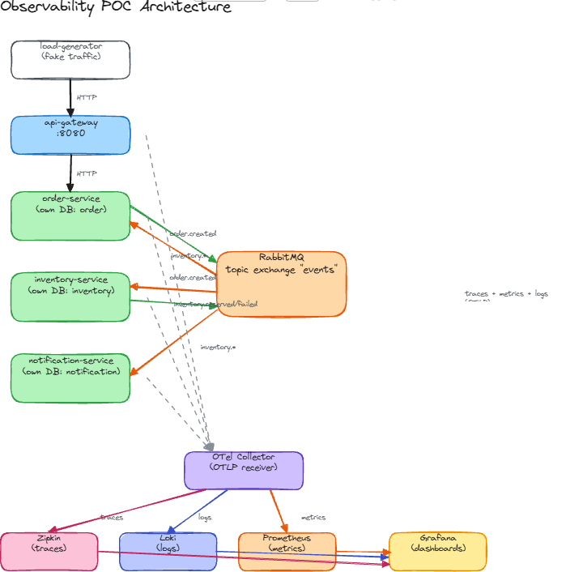

# Observability POC: Node.js Microservices

Node.js microservices wired up with distributed tracing (OpenTelemetry →
Zipkin), metrics (OpenTelemetry → Prometheus → Grafana), centralized logs
(OpenTelemetry → Loki, trace-correlated), and a database per service, tied
together with RabbitMQ. Covers all four observability pillars: metrics,
logs, traces, and (via span events) a taste of events too.

## Architecture



**Flow**: gateway proxies to `order-service`, which creates an order and
publishes `order.created`. `inventory-service` consumes it, tries to reserve
stock in its own DB, and publishes `inventory.reserved` or
`inventory.failed`. `order-service` and `notification-service` both consume
that result: one updates order status, the other simulates an email. A
couple of products are seeded with low/zero stock, so you get a mix of
successful and failed orders out of the box.

## Stack

| Layer | Tool | Role |
|---|---|---|
| Tracing | OpenTelemetry SDK + auto-instrumentation | Patches http/express/pg/amqplib in every service, propagates trace context through RabbitMQ automatically |
| Trace UI | Zipkin | Stores and displays traces exported by the Collector |
| Metrics | OpenTelemetry metrics + Prometheus | Services push OTLP metrics to the Collector, which exposes a `/metrics` endpoint Prometheus scrapes |
| Dashboards | Grafana | Prometheus + Zipkin datasources and one dashboard, all pre-provisioned |
| Messaging | RabbitMQ | One topic exchange (`events`); each service binds its own queue |
| Data | PostgreSQL × 3 | Separate container, volume, and credentials per service |
| Logs | pino + Loki | Every log line carries the active `trace_id`/`span_id`; `instrumentation-pino` forwards each line via OTLP through the Collector into Loki, queryable in Grafana |

## Run it

```bash
docker compose up -d --build
```

Takes ~30–45s to settle (DB init, RabbitMQ, then the load generator waits
10s before its first order).

```bash
docker compose ps                       # check health
docker compose logs -f load-generator   # watch orders flow
```

Stop:

```bash
docker compose stop        # keep data, can resume with `up -d`
docker compose down -v     # wipe everything
```

## Where to look

| What | URL | Notes |
|---|---|---|
| API gateway | http://localhost:8080 | `POST /api/orders`, `GET /api/orders`, `GET /api/inventory`, `GET /api/notifications` |
| Grafana | http://localhost:3300 | `admin` / `admin` → Dashboards → Observability POC |
| Zipkin | http://localhost:9411 | search by service to see a full trace |
| Prometheus | http://localhost:9090 | raw queries, `/targets` |
| Loki | http://localhost:3100 | no UI of its own, query it through Grafana → Explore → Loki |
| RabbitMQ | http://localhost:15672 | `guest` / `guest` |
| order/inventory/notification-service | :3000 / :3001 / :3002 | direct access, bypassing the gateway |
| order/inventory/notification-db | :5433 / :5434 / :5435 | `psql -h localhost -p 5433 -U order_user order_db` |

## What to demo

1. **A full trace**: Zipkin, pick an `api-gateway` trace: HTTP → RabbitMQ publish → inventory reservation → notification, all in one trace, context propagated automatically.
2. **Errors**: notification provider fails ~7% of the time; shows up as red spans in Zipkin and `notifications_sent_total{outcome="failed"}` in Prometheus.
3. **Failures**: `sku-thingamajig` is out of stock, `sku-doohickey` is low, so orders fail reservation regularly. Compare via `GET /api/orders` or the Grafana "order status" panel.
4. **Dashboard**: request rate/errors/latency per service, the order→inventory→notification funnel, queue depth, live stock levels, per-DB connections.
5. **Logs in Loki**: Grafana → Explore → Loki, query `{service_name="order-service"}`. Expand a line and check "Structured metadata" for its `trace_id`/`span_id`, then copy one into Zipkin's search to pivot from a log line to its full trace.

## Layout

```
docker-compose.yml
otel-collector/otel-collector-config.yaml   # OTLP receiver -> Zipkin + Prometheus + Loki
prometheus/prometheus.yml                   # scrape configs
grafana/provisioning/                       # datasources + dashboard
rabbitmq/enabled_plugins                    # management + prometheus plugins
services/
  api-gateway/           # entrypoint, proxies to the 3 services below
  order-service/         # REST API, own DB, publishes order.created
  inventory-service/     # RabbitMQ consumer, own DB
  notification-service/  # RabbitMQ consumer, own DB
  load-generator/        # fake traffic
```

`tracing.js` and `metrics.js` are identical across all 4 services, copied
on purpose rather than shared, so each service's Docker build stays
self-contained.

## Good to know

- Three separate Postgres *containers*, not three databases in one instance. No service can reach another's DB.
- There's no one-click "jump from a log to its trace" link. Grafana's datasource-level `correlations:` provisioning crashed Grafana outright on this version (a nil-pointer panic in its datasource provisioner), so that wiring was left out rather than shipped broken. Copy `trace_id` out of a log line's structured metadata and paste it into Zipkin's search instead.
